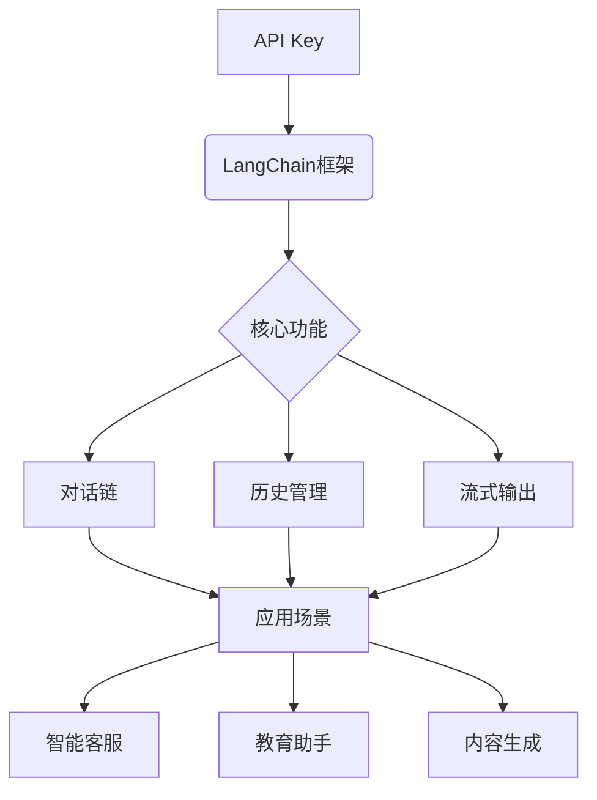

## 一、引言：解锁GPT能力的钥匙

当开发者获得OpenAI API Key时，就像拿到了一把打开智能对话宇宙的钥匙。本文将结合`langchain`框架，通过一个完整的流式聊天Demo，演示如何将API Key转化为具有上下文记忆、多会话管理和流式输出能力的智能对话系统。

<!--more-->

## 二、环境搭建与初始化

### 1. 安全配置API Key
推荐使用独立的配置文件（config.py）管理敏感信息：
```python
# config.py
class Config:
    def __init__(self):
        self.OPENAI_API_KEY = "sk-xxx"  # 替换为真实Key
        self.OPENAI_MODEL = "gpt-3.5-turbo"
```

### 2. 核心依赖安装
```bash
pip install langchain-openai langchain-core langchain-community
```

## 三、流式聊天系统架构解析

### 1. 初始化聊天模型
```python
from langchain_openai import ChatOpenAI

model_chat = ChatOpenAI(model=cf.OPENAI_MODEL)  # 创建模型实例
```

### 2. 构建智能对话链
```python
prompt_template = ChatPromptTemplate.from_messages([
    ('system', '你是一个专业助手，请用{language}尽所能回答所有问题。'),
    MessagesPlaceholder(variable_name='my_msg')  # 动态消息占位符
])

chain = prompt_template | model_chat  # 管道式组合
```

### 3. 会话历史管理
```python
history_msgs = {}

def get_history_msg(session_id: str):
    if session_id not in history_msgs:
        history_msgs[session_id] = ChatMessageHistory()
    return history_msgs[session_id]
```

### 4. 流式响应处理器
```python
do_msg = RunnableWithMessageHistory(
    chain,
    get_history_msg,
    input_messages_key='my_msg'
)
```

## 四、核心功能演示

### 1. 基础对话测试
```python
# 第一轮对话
resp1 = do_msg.invoke({
    'language': '中文',
    'my_msg': [HumanMessage(content='你好，我是dp')]
}, config={'configurable': {'session_id': 'dp123'}})

print(resp1.content)
# 输出：您好，dp！很高兴为您服务。请问今天有什么可以帮您的？
```

### 2. 上下文记忆测试
```python
# 第二轮对话（相同session_id）
resp2 = do_msg.invoke({
    'language': '中文',
    'my_msg': [HumanMessage(content='请问，我的名字叫什么?')]
}, config={'configurable': {'session_id': 'dp123'}})

print(resp2.content) 
# 输出：您的名字是dp，对吗？如果我的记忆有误，请随时纠正。
```

### 3. 流式输出演示
```python
# 第三轮对话（新session_id）
for resp in do_msg.stream({
    'language': '英文',
    'my_msg': [HumanMessage(content='你有什么功能?')]
}, config={'configurable': {'session_id': 'dp1234'}}):
    print(resp.content, end=' - ')

# 流式输出示例：
# I -  can -  assist -  with -  various -  tasks...
```

## 五、高级应用场景

### 1. 多会话管理系统
通过`session_id`实现：
```python
sessions = {
    "user_123": {"session_id": "s_789"},
    "user_456": {"session_id": "s_101"}
}

def get_session_config(user_id):
    return {"configurable": {"session_id": sessions[user_id]["session_id"]}}
```

### 2. 定制化系统角色
修改prompt模板实现角色扮演：
```python
role_template = ChatPromptTemplate.from_messages([
    ('system', '你现在是{role}，请保持角色特征回答问题。'),
    MessagesPlaceholder(variable_name='history'),
    ('human', '{input}')
])
```

### 3. 混合式输出控制
结合流式与非流式处理：
```python
def hybrid_chat(query, stream=False):
    if stream:
        return do_msg.stream({"my_msg": [HumanMessage(content=query)]})
    else:
        return do_msg.invoke({"my_msg": [HumanMessage(content=query)]})
```

## 六、性能优化实践

### 1. 历史记录压缩
```python
from langchain.chains import ConversationChain
from langchain.memory import ConversationBufferWindowMemory

memory = ConversationBufferWindowMemory(k=5)  # 保留最近5轮对话
```

### 2. 异步处理优化
```python
async def async_chat(query):
    return await do_msg.ainvoke({
        "my_msg": [HumanMessage(content=query)]
    })
```

### 3. 缓存策略
```python
from langchain.cache import SQLiteCache
import langchain

langchain.llm_cache = SQLiteCache(database_path=".langchain.db")
```

## 七、生产环境最佳实践

1. **API Key安全**
   - 使用环境变量替代硬编码
   - 定期轮换密钥
   - 设置用量警报

2. **错误处理**
```python
try:
    response = do_msg.invoke(...)
except openai.APIError as e:
    print(f"API Error: {e}")
except Exception as e:
    print(f"Unexpected error: {e}")
```

3. **监控指标**
   - 响应延迟
   - Token使用量
   - 会话保持时长

## 八、扩展应用场景

1. **智能客服系统**
2. **AI教育助手**
3. **内容生成引擎**
4. **编程辅助工具**
5. **多语言翻译服务**

## 九、常见问题解决方案

**Q1 如何处理API限流？**
- 实现指数退避重试机制
- 使用请求队列系统
- 考虑模型降级策略

**Q2 如何提升流式响应速度？**
```python
model_chat = ChatOpenAI(
    model=cf.OPENAI_MODEL,
    streaming=True,
    temperature=0.7,
    max_tokens=500
)
```

**Q3 历史记录存储方案**
- Redis实现高速缓存
- PostgreSQL持久化存储
- 定期归档旧会话

## 十、结语

本文通过一个完整的流式聊天Demo，展示了从API Key到智能对话系统的完整开发链路。建议开发者在此基础上尝试以下扩展：

1. 集成前端Web界面
2. 添加用户认证系统
3. 实现文件解析功能
4. 开发语音交互模块



掌握这些技术后，开发者即可快速构建出满足业务需求的智能对话系统。建议从修改prompt模板开始，逐步探索不同应用场景的可能性。